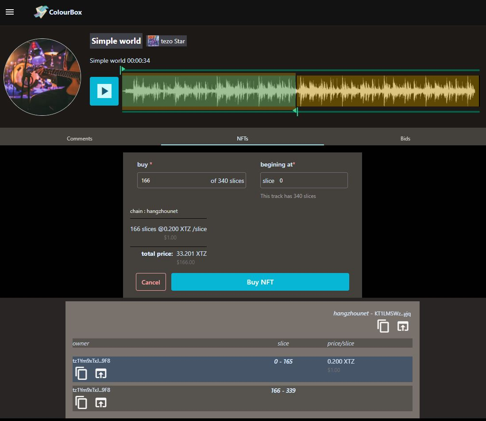

# Overview

**This is a full blown music streaming app that allows the audience to BUY into the music as NFT ‘slices’.** 

For the listener this works like popular streaming apps like Spotify with the added  advantage of being able to buy a slice of the music they like, as a tradable asset, and be part of the Tracks journey.

## Why do we need yet another streaming app or NFT marketplace

The traditional approach where the entire track is “sold” as 1 NFT prohibits the musician from selling “parts” of the Track and still retain enough ownership to benefit from it hitting platinum. 

Solutions with partial NFT ownerships runs foul of “securities” regulations

### But why the streaming part

It’s much more convenient to buy NFT from the platform you are using to listen to music. 

Also current streaming platforms barely pay the bands. We need a solution where The $$$ goes straight to the musicians

### The colourbox solution

We take a fresh approach where each Track essentially becomes a DAO. An uploaded Track is chunked into 1/10 second slices, which are traded as separate NFTs. This allows the content creator to "sell" parts of the song to fundraise their album or simply pay collaborators, while retaining stake in their creation.

# How does it work for the Musician

- For musicians "ColourBox" acts like a "regular" music Distribution portal. It's like CDBaby with NFT
- The musicians signs a "exclusive" distribution agreement with ColourBox, which then NFTize the tracks and essentially Turns each track to a DAO
- The App provides controls for them to be able to push their music to "regular" portals like Spotify, Google play etc, if they so desire.
- Along with simply selling the NFTs, Musicians can choose to allow some tracks to be “streamed” for `free` on the platform or charge a “premium” 
- Just like regular Music labels, ColourBox collects the "radio play royalty" from ASCAP/BMI/SoundExchange and distributes the funds to the NFT owner addresses.

# How does it work for the Fans

- It works like a regular music app (web, android, ios). They can listen to some streams for free or “subscribe” for paid streams.
- For tracks and artists they want to support they can buy “slices” of the track as a regular FA2 NFT.
- They can trade these NFT o this site or on Other NFT marketplaces of their choice.
- They can hold on to these NFTS and get parts of the ‘Royalty” income that comes from “airplay”

# Technical details

- Lazy minting

    A regular track is on an average about 4 min long with around 2400 slices. It is “impossible” to pre mint all these NFT tokens while tokenizing the track. We have created a custom designed lazy minting protocol that mints subdivided slices on the fly.

- Custodial wallets

    We cannot expect all our musicians to be crypto aware. We have planned  ColourBox managed custodial wallets that can be used by the musicians to get into the NFT world and then transfer their NFTs to their own wallets as they get comfortable with crypto.

- Sound Processing and Streaming backend

    Serving “music” is much more complex than serving an image. The “existing” NFT world where we simply store a “bitmap” on IPFS and point to it using Metadata doesn’t cut to the chase. In order for the _colourTrack NFT_ to be **meaningful**, the tracks are uploaded in “**uncompressed**” format. These tracks need to be converted to  variable bit rate mp3s to make them suitable for streaming. 

- Cross chain support

    We are designing this solution with cross chain portability of the NFT assets in mind. 

# UX Considerations

- **Music studio Experience**

This is foremost a “music” app. We are committed to create an Experience that musicians and listeners are familiar with in other music production and streaming apps. We focus on presenting a visual representation of the “wave-form” so that the audience can `visually choose` the slices/breaks they like.

- **One click NFT-izing and sell order**

The NFT creating experience is painless. All we need to do is choose the price and what percent of the song we want to put on the market.

- **Visual NFT buying experience**

The listeners can buy their “slice” of choice using visual tools that allow them to precisely choose the slice they want to buy. 

    The current slices for sale and NFT history are displayed intuitively.

- **Bidding marketplace**

The app allows Fans to `bid` on slices of NFTized and NON NFTized tracks on the platform. This provides additional incentive for the musician to jump into the NFT world.

# ColourBox Validator protocol

Serving music is much more complicated that simply serving images out IPFS

- The tracks needs to be converted to multiple bit rate streams and served on demand
- The original tracks needs to be “protected” against unauthorized downloads
- The airplay “royalty” `fiat` needs to be collected from ASCAP/BMI/SoundExchange and distributed to the NFT owners.
- AND all the above needs to be done in a **decentralized manner.**

Our protocol is still a work in progress with the following goals

- The colourBox streaming and revenue collecting infrastructure will be a DAO with membership defined by a ColourBox governance token.
- Governance Token holders, over a certain threshold, will be allowed to operate colourBox, validator nodes.
- These Validator nodes will be assigned “track processing and distributing” workloads proportional to their “**stake**” in the governance token pool. These nodes will be awarded “NFT-izing” fees (paid by artists when they NFTize a track) and subscription fees ( paid by premium listerenes), proportional to the actual “workload” they `mine.`
- Governance Token holders, over a certain threshold, can “propose” to run an **“Artist Representation node”**. Once voted in by the simple majority of governance token holders, An Artist representation node, can be chosen by a Musician to collect their tracks Royalties and distribute them in return for a “management” fees.

 

   

# Project Status and backlog

## Current status

- During this hackathon, we focused on Proof of concept and created a MVP with  lazy-minting, FA2, and factory smart contracts
- The UI for creating profiles, uploading music, creating and selling NFTs is complete
- The backend for processing and streaming audio is complete
- The groundwork for multichain asset portability is close to completion.
- The bidding marketplace UI and backend are in progress.

## Product backlog

- Create containerized validator nodes, that can be spun up by Governance taken holder
- Create ways for NFT holders to be able to download the “uncompressed” NFT slice they purchased.
- Create a Slice Storage protocol within the validator network which can guarantee “redundancy and longevity” of the NFT content, while ensuring that copyrighted material is not pirated. 
- Finish up the “bidding” marketplace
- Release the IOS and Android Apps
- Create API integration with “Sono suits” to add ability to push music to the Online digital distribution stores (Spotify, amazon play etc).
- Subscription solution for listeners
- Recommendation engine, to showcase music to listeners depending on the social and listening patterns
- Award system for “promoters and influencers” that can promote a track in return of NFT slices.
- Integration with FIAT (paypal, stripe) so that this app can act as a bridge for musicians and listeners that are on the fence about crypto

      
