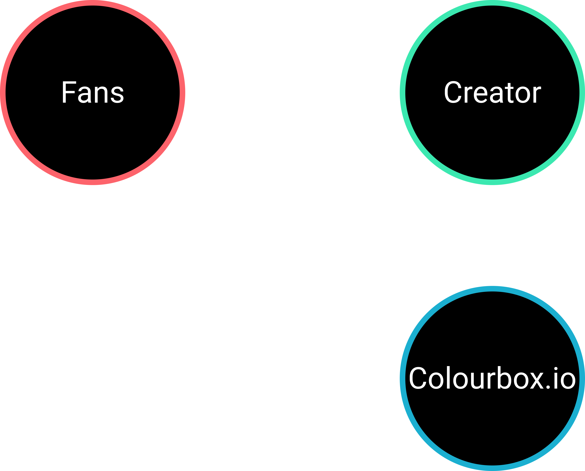
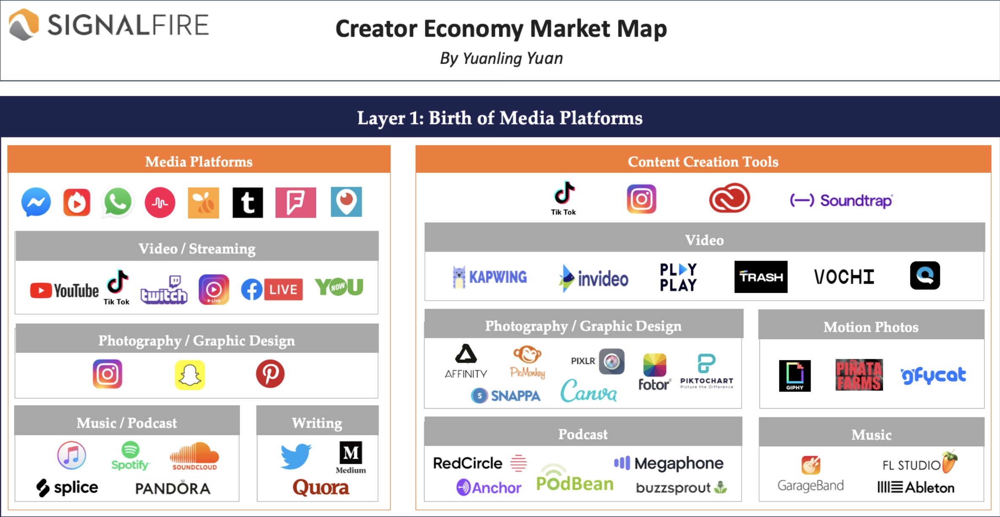
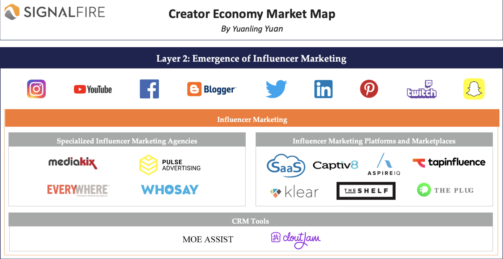
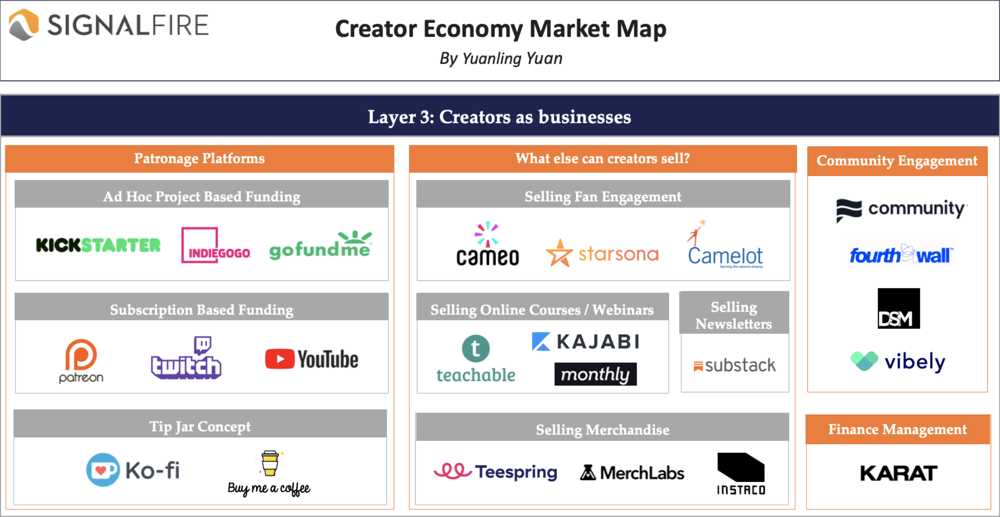
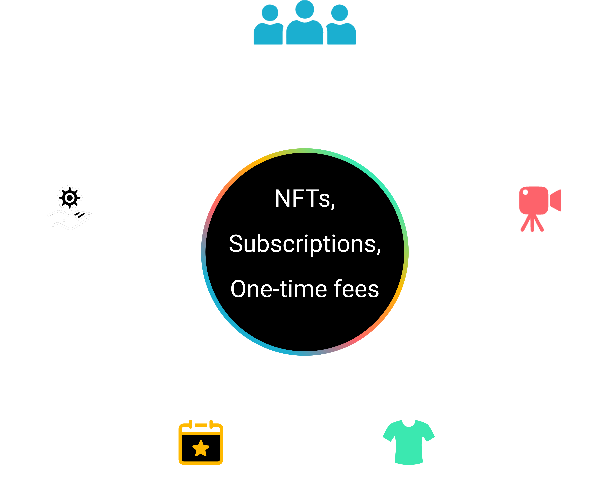

# Colourbox Litepaper

## MUCH NEEDED CHANGE

We are building a world where creators can make a sustainable income directly from their fanbase and supporters. Creators no longer have to go viral or be famous in order to make a living. Now creators can focus on creating content and value for their existing fans and in return, fans can support their favorite creator directly and receive more value than ever before. No more cliche clickbaity or sponsored content. No more receiving fractions of a penny per view/stream. No more greedy middlemen. A world with Colourbox is a world where authentic art, content, and entertainment reign supreme and are truly valued.

Current creator economy:

Creator economy with Colourbox:

## THE PROBLEM

Lack of monetization options and control for creators. We all know a starving artist or know of one. To understand why there are still starving artists in a world that is more connected than ever we need to understand the creator economy, how its evolved, and where it's going.

### Phase 1: The birth of media platforms.

Image taken from article written by Signalfire: https://signalfire.com/blog/creator-economy/

*“Since the late 2000s, we witnessed the birth of platforms like YouTube, Instagram, iTunes, Spotify, and more recently Snapchat, Twitter, Medium, Twitch, TikTok, etc. Platforms help creators get discovered and establish an audience by investing heavily in their recommendation and curation algorithms — they solved the distribution problem for creators. No longer were creators at the mercy of large production companies who decided what content to produce and who the audience would be.”*

Pros:
- Discoverability
- Decentralized from large production companies
- Lower barrier of entry to create and publish

Cons:
- Lack of monetization tools/options
- Lack of control over the content published on these platforms
- Subject to algorithms created by the platforms

### Phase 2: Emergence of influencer marketing.

Image taken from article written by Signalfire: https://signalfire.com/blog/creator-economy/

*“Once top creators had built an established audience who trusted what they had to say, brands started to recognize the return on investment of paying creators to harness their on-platform reach to advertise products and services. While some platforms split traditional ad revenue with creators, others left it up to the content makers to figure out how to monetize…Ideally, creators work with sponsors that match their personal brand, and don’t sacrifice content quality to overtly push a corporate message. However, as influencer marketing grew more common and more brands started paying for it, influencers noticed a pattern: with each paid post, they’d lose some of the trust that they established with their audience, hurting their engagement and growth.”*

Pros:
- Monetization options available
- Rewarding for creators that got in early

Cons:
- Only benefits those with a large following/audience (rich get richer, poor stay poor)
- Limited monetization options
- Fans dislike ads and sponsored messages

### Phase 3: Creators as businesses.

Image taken from article written by Signalfire: https://signalfire.com/blog/creator-economy/

*“This is where we are today! Having developed fandoms that follow them off-platform, creators can become full-fledged businesses with multiple revenue streams beyond ads. Companies have arrived to help creators earn money by selling products such as premium content, merchandise, books/ebooks, newsletters, or selling services such as fan engagement, coaching, consulting, speaking engagements, etc. This lets creators focus on delighting their biggest fans and making more unique niche content, rather than desperately seeking the biggest possible audience and making more generic clickbaity content.”*

Pros:
- More monetization options for creators of all types and fanbase sizes

Cons:
- No all-in-one solution
    - Different platforms offering different solutions
        - Limited to either subscriptions or one-time donation models
        - Harder to keep organized for creators and harder for fans to see/buy into all the benefits their favorite creator is offering.
- No NFT or web 3 monetization options are currently available
    - Assets aren’t tradeable/resellable by fans
    - Creators miss out on resale royalties

## WHAT IS COLOURBOX

Colourbox is the ultimate all-in-one monetization tool for creators. Colourbox empowers creators to make money directly from their fans by selling access to premium content, merchandise, events, services, and communities in the form of NFTs, subscriptions, or one-time purchases.

## HOW DOES COLOURBOX WORK

For the Creators:
1. A creator creates an account. 
2. The creator then creates a project. 
    - Project = Perks x Tools (Example: Project = Content access x NFT)
        - Perks = Community access, Content access, Merchandise access, Event access, and Services access.
        - Tools = NFT, Subscription, and One-time fee
3. The creator posts a link to their Colourbox page on their existing social media accounts so fans can easily discover and access it.

For the Fans:
1. Fan clicks link to their favorite creators Colourbox page.
2. Fan selects the project they want to buy.
3. Fan quickly creates an account using an OTP/Web 3 wallet
4. Fan completes the purchase process

## WHAT PROBLEM IS COLOURBOX SOLVING

Colourbox is making it simple and easy for creators to make more money from their existing fanbase and content. No extra work, no extra platforms. All creators have to do is sign up, create a project, and add the project link to their existing social platforms so fans can discover and buy the project. It’s that easy.

Now creators can focus on creating content they and their fans are passionate about. Now creators can earn a living from their niche fanbase instead of needing a viral audience.

## WHY WE USE WEB 3 TECHNOLOGY

Now with the introduction of NFTs creators can give more value to their work, community, and perks by authenticating them on the blockchain. If it’s a project that has non-reusable perks, like a one-day event, the NFT might act as a form of memorabilia. Much like a baseball card, if you bought it early it is rare since the athlete wasn’t as popular. The same argument is made for NFTs. Now imagine a project with recurring perks. Imagine if you owned a ticket to an event that keeps occurring and is limited in attendance. If that event increases in popularity more people will want to come. If more people want to come their only option is to outbid current ticket holders… if that happens then you made more money from the resale than you spent on the original ticket, and the creator made some money on the resale royalties as well. True web 3 means a true win-win scenario between all parties involved. No greedy middle-men, and no more predatory platforms with predatory terms of service. Now fans can also potentially benefit from supporting their favorite creators instead of just donating a coffee or a monthly fee.

## WE WIN WHEN YOU WIN

We’ve seen it so many times with platforms like Spotify where they come in with a hoorah attitude and make themselves appear like David when they really want to be Goliath.

The truth is we are a business. We need to make money. However, we aligned our business model in a way that doesn’t hurt creators. We call it the 80/20 rule. Creators keep 80% of their earnings that come directly from fans and Colourbox keeps 20% to maintain the tools and platform. We give creators a majority of the pie because they do a majority of the work. It’s our sign of respect and appreciation for every creators passion, vision, and craft. We (the founding team) are creators ourselves. Solving the “starving artist” problem is what has brought us together, and we will not stop until it is fixed.    
